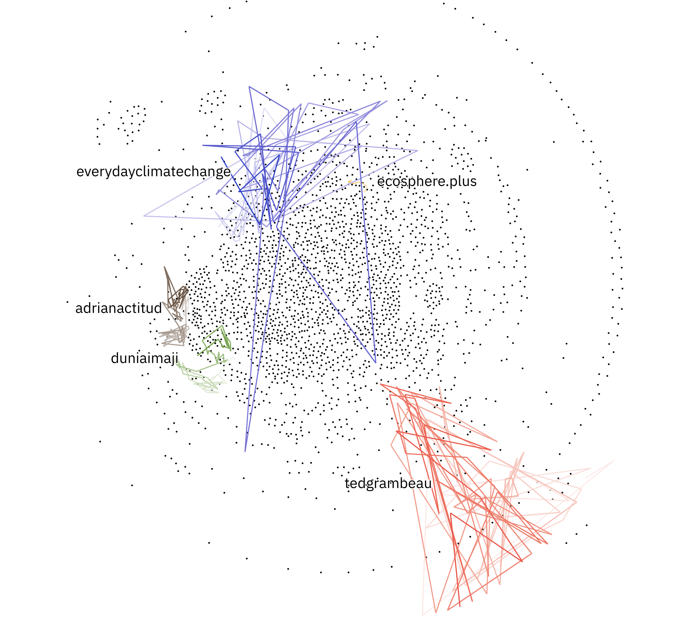

# anci-hackathon

The idea of this project is to place Instagram posts by single users over time on a non-spacial map.

This non-spacial map is created by a network of hashtags used during the #climatechange movement.
Basis for this project is a CSV-list of Instagram posts that used the `climatechange` hashtag.

First, I used Ruby to process the csv list and extracted all used hashtags. Then I created the edges of the network by creating links between nodes (hashtags) if they occure in the same post. This allowed me to generate a force directed network using D3.

In the next step, I filtered out the user with the highest popularity by likes. For every of these users I collected the posts and their hashtags. I used the previous generated network as fixed nodes map. Again I used a force directed network algorithm to place the images by using their hashtags as links in the existing network.

To finish the graph I connected these posts with lines and used ChromaJS to color these link with decreasing saturation to mark a temporal order.

## Sidenotes
- I left out the names of the hashtags (nodes) and also the edges out as this graphic focuses on the dynamics of the user and how the position their posts within this space
- The next step would be to also include the popularity of the posts by scaling the dots by links
- Interactivity and other data could also be added in the next step
